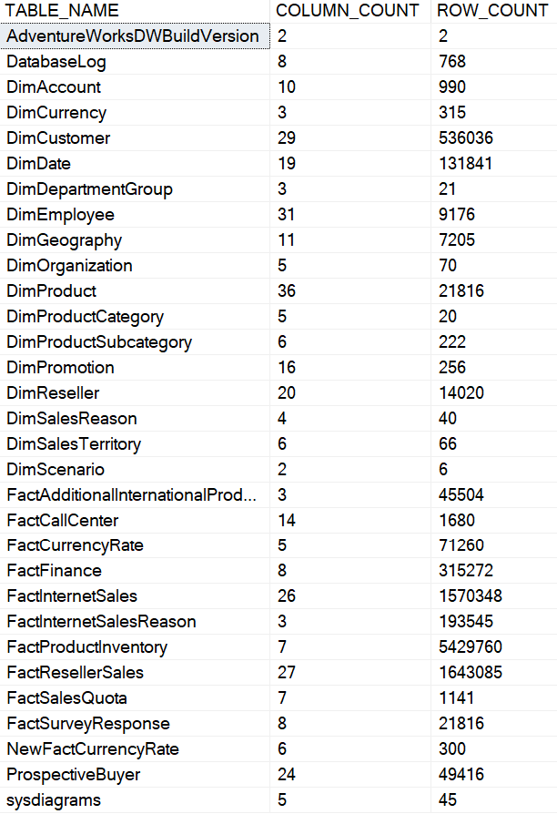
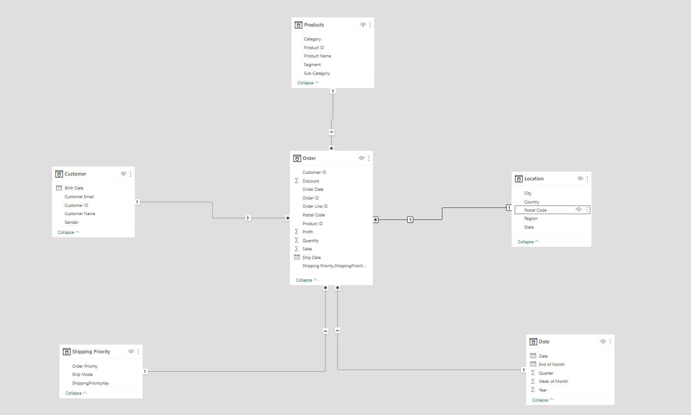

# Sales Performance Analysis of Adventure Works

<p align="center">
  
</p>

## About Adventure Works

Adventure Works is a large, multinational manufacturing company that produces and distributes bicycles, parts, and accessories for commercial markets in North America, Europe, and Asia. The company employs 500 workers. Additionally, Adventure Works employs several regional sales teams throughout its market base.

## Business Questions

My task is to provide answers to the following business questions using the Adventure Works Database. Here are the business questions;

1. What is the current market demand for our products and how does it vary by region?
2. What is our current sales performance and how does it compare to past performance and industry benchmarks?
3. What is the customer satisfaction and loyalty level, and what actions can we take to improve it?

## Skills Demonstrated

Data Cleaning & Wrangling in SQL

Data Transformation in Power Query

Data Analysis Expression in Power BI

Data Visualization with Power BI & Microsoft PowerPoint

## Project Steps

- Download prerequisites
- Install Database backup
- Read through requirements and prepare user story
- Identify required tables
- Clean tables and create view
- Connect to Views in Power Query
- Data Transformation in Power Query
- Data Modeling
- Create Measures
- Data Visualization
- Publish to Power BI Service

## Data Source & Import

I installed the database from [here](https://github.com/Microsoft/sql-server-samples/releases/download/adventureworks/AdventureWorksDW2019.bak). I used the backup file in the data warehouse. Afterwards, I followed the steps outlined [here](https://learn.microsoft.com/en-us/sql/samples/adventureworks-install-configure?view=sql-server-ver16&tabs=ssms#tabpanel_1_ssms). 

## About the Dataset

In other to know how my `AdventureWorksDW2019` database looks like so I can have a general overview of it. I used this SQL code to check types of tables, number of columns and rows each table has. I therefore used the query below

```sql
SELECT
    t.NAME AS TABLE_NAME,
    COUNT(c.NAME) AS COLUMN_COUNT,
    SUM(p.rows) AS ROW_COUNT
FROM
    sys.tables AS t
INNER JOIN
    sys.columns AS c ON t.object_id = c.object_id
INNER JOIN
    sys.partitions AS p ON t.object_id = p.object_id
WHERE
    t.is_ms_shipped = 0
    AND p.index_id < 2
GROUP BY
    t.NAME;
```

And It returned this table



As you can see, the dataset contains 43 tables and lots of data that is unnecessary for our analysis.

That takes us to the next process which involves Data Cleaning and Wrangling.

## Data Cleaning & Wrangling

In this process we will review the business questions and know which tables and attributes we need for our analysis.

In the first business question (What is the current market demand for our products and how does it vary by region?) I can derive that we need 4 entities to answer the business question effectively which are:

1. Product
2. Orders or Sales
3. Customers
4. Regions and Geography

In the second business question (What is our current sales performance and how does it compare to past performance and industry benchmarks)

1. Sales or Orders
2. Date or Time
3. Products
4. Customers
5. Adventureworks Targets

In the third business question (What is the customer satisfaction and loyalty level, and what actions can we take to improve it?)

1. Customers
2. Sales or Orders
3. Customer Feedbacks

After obtaining a comprehensive understanding of the relevant tables and attributes required for analysis, I utilized a variety of SQL query codes to carry out data wrangling processes.

Here are the queries I used to return tables that will help with my analysis

- This query below drops any existing view named `fact_internet_sales_view` and creates a new view with the same name. The view selects specific columns from the `FactInternetSales` table, applies filters to include data from the last three years, and calculates the "Profit" column by ([SalesAmount] - [TotalProductCost]). The final result is ordered by "OrderDateKey”
    
    ```sql
    -- Drop the view if it already exists
    DROP VIEW IF EXISTS fact_internet_sales_view;
    
    -- Create a new view called fact_internet_sales_view
    CREATE VIEW fact_internet_sales_view AS
        -- Select the top 100 percent of rows from the source table
        SELECT TOP 100 PERCENT
            -- Concatenate salesordernumber, salesorderlinenumber, and additional characters as SalesOrderLineKey
            CONCAT(RIGHT(salesordernumber, 5), '00', salesorderlinenumber) AS SalesOrderLineKey,
            [OrderDateKey],
            [DueDateKey],
            [ShipDateKey],
            [CustomerKey],
            [ProductKey],
            [SalesTerritoryKey],
            [SalesOrderNumber],
            [OrderQuantity] AS [Order Quantity],
            [UnitPrice] AS [Unit Price],
            [ExtendedAmount] AS [Extended Amount],
            [ProductStandardCost] AS [Product Standard Cost],
            [TotalProductCost] AS [Total Product Cost],
            [SalesAmount] AS [Sales Amount],
            [SalesAmount] - [TotalProductCost] AS Profit
        -- Select from the FactInternetSales table
        FROM FactInternetSales
        -- Filter the data to include only the past three years based on the OrderDateKey
        WHERE LEFT(OrderDateKey, 4) >= YEAR(GETDATE()) - 3
        -- Order the results by OrderDateKey in ascending order
        ORDER BY OrderDateKey ASC;
    ```
    
- This query below drops any existing view named `dim_sales_territory_view` and creates a new view with the same name. The view selects specific columns from the `DimSalesTerritory` table, renames them, and excludes territories with a country value of 'NA'.
    
    ```sql
    -- Drop the view if it already exists
    DROP VIEW IF EXISTS dim_sales_territory_view;
    
    -- Create a new view called dim_sales_territory_view
    CREATE VIEW dim_sales_territory_view AS
        -- Select specific columns from the DimSalesTerritory table
        SELECT 
            [SalesTerritoryKey],
            [SalesTerritoryRegion] AS Region,
            [SalesTerritoryCountry] AS Country,
            [SalesTerritoryGroup] AS [Group]
        -- Specify the source table as [AdventureWorksDW2019].[dbo].[DimSalesTerritory]
        FROM [AdventureWorksDW2019].[dbo].[DimSalesTerritory]
        -- Filter the data to exclude territories with a country value of 'NA'
        WHERE SalesTerritoryCountry <> 'NA';
    ```
    
- This query below drops any existing view named `dim_products_view` and creates a new view with the same name. The view selects specific columns from the `DimProduct` table, joins it with related tables, and includes additional columns from those tables. The result set is ordered by "ProductKey.”
    
    ```sql
    -- Drop the view if it already exists
    DROP VIEW IF EXISTS dim_products_view;
    
    -- Create a new view called dim_products_view
    CREATE VIEW dim_products_view AS
        -- Select specific columns from the DimProduct table
        -- and join with DimProductSubcategory and DimProductCategory tables
        SELECT TOP 100 PERCENT
            p.[ProductKey],
            p.[ProductAlternateKey] AS SKU,
            p.[EnglishProductName] AS Product,
            P.StandardCost AS [Standard Cost],
            p.[Color] AS [Product Color],
            p.ListPrice AS [List Price],
            p.[ModelName] AS Model,
            ps.EnglishProductSubcategoryName AS SubCategory, -- Joined in from Sub Category Table
            pc.EnglishProductCategoryName AS Category, -- Joined in from Category Table
            p.[EnglishDescription] AS [Product Description],
            P.LargePhoto AS [Product Photo],
            ISNULL(p.Status, 'Outdated') AS [Product Status]
        -- Specify the source tables
        FROM 
            DimProduct AS p
            LEFT JOIN DimProductSubcategory AS ps 
            ON ps.ProductSubcategoryKey = p.ProductSubcategoryKey
            LEFT JOIN DimProductCategory AS pc 
            ON ps.ProductCategoryKey = pc.ProductCategoryKey
        -- Order the results by ProductKey in ascending order
        ORDER BY 
            p.ProductKey ASC;
    ```
    
- This query below drops any existing view named `date_view` and creates a new view called `dim_date_view`. The view selects specific columns from the `DimDate` table, performs some transformations and calculations on the selected data, and filters the result set to include only the past three years of data based on the current date.

```sql
-- Drop the view if it already exists
DROP VIEW IF EXISTS date_view;

-- Create a new view called dim_date_view
CREATE VIEW dim_date_view AS
    -- Select specific columns from the DimDate table
    SELECT 
        [DateKey],
        [FullDateAlternateKey] AS Date,
        [EnglishDayNameOfWeek] AS Day,
        [EnglishMonthName] AS Month,
        LEFT([EnglishMonthName], 3) AS MonthShort, -- Useful for front end date navigation and front end graphs
        [MonthNumberOfYear] AS MonthNo,
        DATEFROMPARTS(CalendarYear, MonthNumberOfYear, 1) AS [Year-Month],
        CONCAT(LEFT([EnglishMonthName], 3), ' ', CalendarYear) AS [Year_Month_Eng],
        [CalendarQuarter] AS Quarter,
        CONCAT('Q', CalendarQuarter, '-', CalendarYear) AS [Quarter-Year],
        [CalendarYear] AS Year
    -- Specify the source table as [AdventureWorksDW2019].[dbo].[DimDate]
    FROM [AdventureWorksDW2019].[dbo].[DimDate]
    -- Filter the data to include only rows where CalendarYear is greater than or equal to three years ago
    WHERE CalendarYear >= YEAR(GETDATE()) - 3;
```

- This query below drops any existing view named `dim_customers_view` and creates a new view with the same name. The view selects specific columns from the `DimCustomer` table and performs joins with related tables to include additional columns. The result set is ordered by "CustomerKey".
    
    ```sql
    -- Drop the view if it already exists
    DROP VIEW IF EXISTS dim_customers_view;
    
    -- Create a new view called dim_customers_view
    CREATE VIEW dim_customers_view AS
        -- Select specific columns from the DimCustomer table
        -- and join with DimGeography and DimSalesTerritory tables
        SELECT TOP 100 PERCENT
            c.customerkey AS CustomerKey,
            c.firstname + ' ' + lastname AS [Full Name],
            CASE c.gender
                WHEN 'M' THEN 'Male'
                WHEN 'F' THEN 'Female'
            END AS Gender,
            c.datefirstpurchase AS DateFirstPurchase,
            g.city AS [City], -- Joined in Customer City from Geography Table
            g.stateprovincename AS [State-Province],
            g.englishcountryregionName AS Country,
            st.SalesTerritoryRegion AS Region,
            g.postalcode AS [Postal Code]
        -- Specify the source tables
        FROM
            DimCustomer AS c
            LEFT JOIN DimGeography AS g
                ON g.geographykey = c.geographykey
            LEFT JOIN DimSalesTerritory AS st
                ON g.SalesTerritoryKey = st.SalesTerritoryKey
        -- Order the results by CustomerKey in ascending order
        ORDER BY
            CustomerKey ASC;
    ```
    
- This query below creates a view that provides insights into customer cohorts and retention on a monthly basis. It calculates the number of customers in each cohort, the number of customers retained each month, and the percentage of retained customers.
    
    ```sql
    -- Drop the view if it already exists
    DROP VIEW IF EXISTS cube_customer_cohort_monthly;
    GO
    
    -- Create a new view called cube_customer_cohort_monthly
    CREATE VIEW cube_customer_cohort_monthly AS
    (
        -- Common Table Expression to calculate customer cohort
        WITH customer_cohort AS (
            SELECT
                c.customerkey,
                c.country,
                p.category,
                MIN(DATEADD(mm, DATEDIFF(mm, 0, d.date), 0)) AS cohort_month
            FROM
                fact_internet_sales_view s
                JOIN dim_date_view d ON s.OrderDateKey = d.DateKey
                JOIN dim_customers_view c ON s.CustomerKey = c.CustomerKey
                JOIN dim_products_view p ON s.ProductKey = p.ProductKey
            GROUP BY
                c.customerkey,
                c.country,
                p.category
        ),
    
        -- Common Table Expression to calculate customer activities
        customer_activities AS (
            SELECT
                cc.customerkey,
                cc.country,
                cc.category,
                DATEADD(mm, DATEDIFF(mm, 0, d.date), 0) AS month_num_lab,
                DATEDIFF(month, cc.cohort_month, d.date) AS month_number
            FROM
                fact_internet_sales_view f
                JOIN dim_date_view d ON f.OrderDateKey = d.DateKey
                JOIN dim_products_view p ON f.ProductKey = p.ProductKey
                LEFT JOIN customer_cohort cc ON cc.customerkey = f.customerkey
                    AND cc.category = p.category
            GROUP BY
                cc.customerkey,
                cc.category,
                cc.country,
                DATEADD(mm, DATEDIFF(mm, 0, d.date), 0),
                DATEDIFF(month, cc.cohort_month, d.date)
        ),
    
        -- Common Table Expression to calculate cohort size
        cohort_size AS (
            SELECT
                cohort_month,
                COALESCE(category, 'all') AS category,
                COALESCE(country, 'all') AS country,
                COUNT(DISTINCT customerkey) AS month_num_customers
            FROM
                customer_cohort
            GROUP BY
                cohort_month,
                CUBE(category, country)
        ),
    
        -- Common Table Expression to calculate retention table by month
        retention_table_month AS (
            SELECT
                cc.cohort_month,
                COALESCE(ca.category, 'all') AS product_category,
                COALESCE(ca.country, 'all') AS country,
                ca.month_num_lab,
                ca.month_number,
                COUNT(DISTINCT ca.customerkey) AS num_customers_month
            FROM
                customer_activities ca
                LEFT JOIN customer_cohort cc ON ca.customerkey = cc.customerkey
                    AND ca.category = cc.category
                    AND ca.country = cc.country
            GROUP BY
                cc.cohort_month,
                ca.month_num_lab,
                ca.month_number,
                CUBE(ca.category, ca.country)
        )
    
        -- Final query to select desired columns from the retention table and perform calculations
        SELECT TOP 100 PERCENT
            ry.cohort_month,
            DATEPART(YEAR, ry.cohort_month) AS cohort_year,
            ry.month_number,
            ry.month_num_lab,
            ry.product_category,
            ry.country,
            cs.month_num_customers AS total_customers_month,
            ry.num_customers_month AS retained_customers_month,
            ROUND(
                CONVERT(FLOAT, ry.num_customers_month) / CONVERT(FLOAT, cs.month_num_customers),
                2
            ) AS percentage_month
        FROM
            retention_table_month ry
            LEFT JOIN cohort_size cs ON ry.cohort_month = cs.cohort_month
        WHERE
            ry.cohort_month IS NOT NULL
            AND ry.month_num_lab IS NOT NULL
            AND ry.product_category = cs.category
            AND ry.country = cs.country
        ORDER BY
            ry.cohort_month,
            ry.month_number,
            product_category,
            country
    );
    ```
    

 

- I also got a query code from [here](https://github.com/maleekthedatafied/adventureworks_dataupdate) to update my database with new data update to the year 2023

After creating all these views, I connected my database to Power BI for futher Data Transformation, Data Modelling and Analysis where I imported all my tables.

### Data Modelling

I created a Star Schema for the tables and Here is a Screenshot of it.



[Tap here to find your dashboard, insights, and recommendations based on the datasets.](https://mavenanalytics.io/project/7018)
